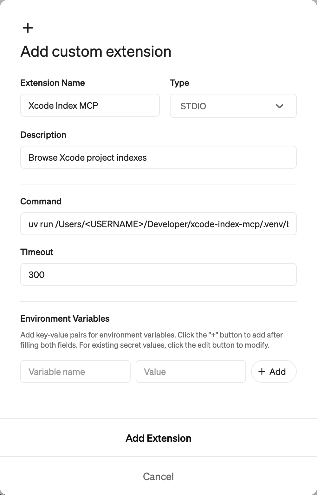

# Xcode Index MCP

Gives Goose/Cursor access to your iOS/macOS project index through the Model Control Protocol (MCP) and IndexStoreDB. This provides exhaustive lists of function call sites to help your agent with refactoring and code navigation.

## Example prompt

"Remove `myParameter` from the initializer on line 48 of `MyViewController.swift`. Use the Xcode Index MCP to ensure all references are updated."

## How to use

1. Install `uv` (Python package manager) and run `uv sync`
    ```bash
    brew install uv
    cd /path/to/this/repo
    uv sync
    ```

2. Build the Swift service (Xcode must be installed)
    ```bash
    cd swift-service
    swift build
    ```
    This step is required as it provides the interface to Xcode's index.

3. Install in Agent of your choice

    ### Goose:

    Go to settings and add a custom extension. In the modal that pops up, under the `command` field, add this line:

    ```bash
    uv run /Users/<USERNAME>/Development/xcode-index-mcp/.venv/bin/xcode-index-mcp
    ```
    Note: Replace `<USERNAME>` with your actual system username, or with the correct path xcode-index-mcp on your machine.

    The rest should look something like this:

    

    ### Cursor:

    Go to `Settings > MCP > Add new global MCP server`. Update mcp.json (typically located in your Cursor configuration directory) to look something like this:
    
    ```json
        {
            "mcpServers": {
                "Xcode Index MCP": {
                    "command": "uv",
                    "args": ["run", "/Users/<USERNAME>/Development/xcode-index-mcp/.venv/bin/xcode-index-mcp"]
                }
            }
        }
    ```
    Note: Replace `<USERNAME>` with your actual system username, or with the correct path xcode-index-mcp on your machine.

    ### Claude Code:

    Run this command in the terminal to add the mcp to Claude Code
    ```bash
    claude mcp add xcode-index-mcp -- uv run /Users/<USERNAME>/Development/xcode-index-mcp/.venv/bin/xcode-index-mcp
    ```
    Note: Replace `<USERNAME>` with your actual system username, or with the correct path xcode-index-mcp on your machine.

4. Update `.gooseHints`, `cursorRules`, or `CLAUDE.MD`  in your project to tell your agent how to use the plugin. Replace the project name with the name of your project as it appears in the derived data folder. 

    ```
    Use tool `xcode-index-mcp` if available. Use project name <Your project name here>. The tool can locate call sites of functions, and function definitions from call sites. If you need a filepath to make a request, use `rg` to find the file and `rg -n` to find the line number. Use the absolute path when requesting symbols from a file.
    ```

    For Cursor, you may want to add these [instructions](https://github.com/block/xcode-index-mcp/blob/main/src/xcode_index_mcp/server.py#L14-L52) in their own rule file - at the time of writing I don't think cursor reads the MCP `instructions` field.

## Running tests

To run tests for Swift, cd into `swift-service` and run `swift test`.

## How it works

The tool consists of two main components:
1. An MCP server in the `src` directory that handles communication with Goose/Cursor
2. A Swift service in the `swift-service` directory that interfaces with Xcode's index using Apple's `IndexStoreDB` package

When the MCP server calls 'load_index', the Swift service will look through Xcode's derived data directory for a project file. When found it will attempt to load the project's index. Queries are passed from the MCP server to the index through a subset of the methods provided in [IndexStoreDB](https://github.com/swiftlang/indexstore-db/blob/main/Sources/IndexStoreDB/IndexStoreDB.swift).
